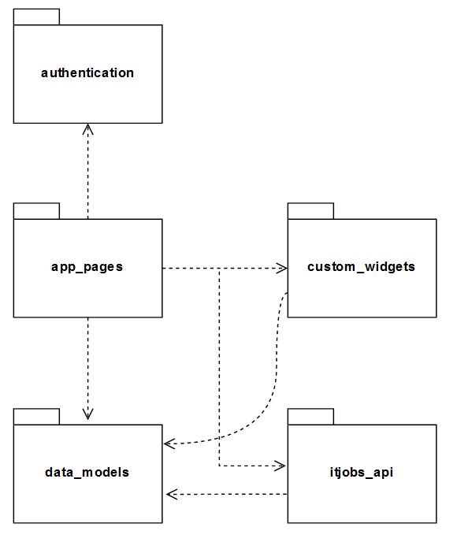
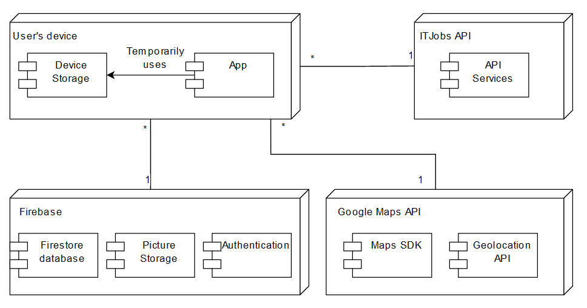

## Architecture and Design
In this file we will describe the architecture and the design behind our app.

### Logical architecture
Our app's structure was planned with the goal of being easy to understand just by looking at the code, but at the same time to ease future work and upgrades on it. It is divided in the following packages:

- `app_pages` - this package contains all the source code for the pages that will be displayed to the user
- `custom_widgets` - this package contains all the widgets that the app uses to show information to the user
- `data_models` - this package structures used to organize the information in the database
- `itjobs_api` - this package contains the interface to interact with the ITJobs API
- `authentication` - this package contains the interface to interact with the Firebase Authentication API

Here's a simple explanation of the packages' interactions:
- `app_pages` uses `custom_widgets` to display the information gathered from objects of `data_models` in a friendly and organized way
- `app_pages` uses `itjobs_api` to get the information from the ITJobs API, more specifically in the search page and home page
- `app_pages` is dependent on `authentication` to know if the user is logged in or not, so it can display his respective information
- `itjobs_api` uses `data_models` to build and store correctly the information gathered from the ITJobs API
- `custom_widgets` uses `data_models` to know how which information is going to be displayed depending on the object

One thing data could be improved in future work is the isolation of all the interface not only between the app and the Firestore database, but also with the Google Maps API, in individual packages, so it would be easier to change them in the future, if needed.

 

    

    Fig. 1 - Logical Architecture UML

### Physical architecture
In our app, there are 4 entities involved:

- `Firebase` - cloud storage and authentication service
- `User device` - where the app will run and temporarily use the device storage
- `ITJobs API` - the only API used in this project, responsible for most of the data used in the app
- `Google Maps API` - allows us to use the map and is also used for geolocation purposes

Here's a quick rundown on the 4 entities' interactions:
- The user device is the main entity in this environment. The app runs on it and, therefore, all the interactions with the other entities are dependant on it. Besides that, the device storage is uses only when the app is running to store temporary data, for example, from searches. There is no persistent data
- To get the user's information, such as profile information, favorites, the app (running on the user's device) makes calls to the Firebase Firestore database. When new information is added, like a new favourite, the app also communicates this information to the database
- To authenticate the user, the app makes calls to the Firebase Authentication API to validate user credentials and his login status
- To fetch information about job posts, the app makes calls to the ITJobs API to fetch the information and then stores it in the device storage
- The app makes calls to the Google Maps API to use the Maps SDK to have a interactive world map and to use the Geocoding API to convert job post's addresses to coordinates to draw them on the map

    

    Fig. 2 - Physical Architecture UML

### Vertical prototype
In our vertical prototype, we implemented multiple pages (Home Page, Favorites Page and Help Page), to give a basic idea of what we want to create. Also, we added a simple button widget, just to show some "state" functionality, a key feature that we will need in the app.

The source code for our vertical prototype can be found in the first release.

