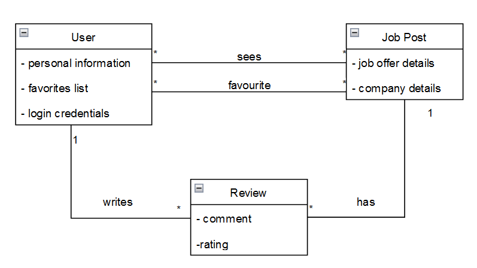

# Requirements

## User stories
### Story nº 1
As a user, I want to search for a specific job offer, without having to scroll through all the ads, so that I can find the job I want faster.

### User interface mockup


### Acceptance tests
```Gherkin
Scenario: Search for Java Developer jobs.
  Given The search screen
  When I tap the search bar
  And I insert "Java Developer"
  And I tap the search button,
  Then the results of the search for "Java Developer" appear
```

### Value and effort estimation
- Value: Must-have
- Effort: 8

---

### Story nº 2
As a user, I want to see the reviews and/or opinions on a certain job offer, so that I can have a better idea of what the job is like.

### User interface mockup


### Acceptance tests
```Gherkin
Scenario: See the reviews about a job offer.
  Given The post of a job offer
  When I tap "Reviews",
  Then the reviews about the job offer appear
```

### Value and effort estimation
- Value: Should-have
- Effort: 8

---

### Story nº 3
As a user, I want to be able to filter job offers by different criteria, not only to make my search easier and also to find the job I want faster, but also to compare different job offers.

### User interface mockup


### Acceptance tests
```Gherkin
Scenario: Filter the search.
  Given The search screen
  When I tap the filters button
  And I select the criteria I want to filter by
  And I tap "Search",
  Then the results of the search for appear filtered by the criteria I selected
```

### Value and effort estimation
- Value: Must-have
- Effort: 13

---

### Story nº 4
As a user, I want to have easy and interactive access to job offers in different locations, so that I can find a job in a place that I prefer.

### User interface mockup


### Acceptance tests
```Gherkin
Scenario: See the job offers in Porto.
  Given The main screen
  When I tap "Porto",
  Then the job offers in Porto district appear
```

### Value and effort estimation
- Value: Must-have
- Effort: 8

---

### Story nº 5
As a user, I want to be able to mark a job offer as favorite, so that I can easily find it later.

### User interface mockup


### Acceptance tests
```Gherkin
Scenario: Mark a job offer as favorite.
  Given The post of a job offer
  When I tap the favorite button,
  Then the job offer is marked as favorite
```

### Value and effort estimation
- Value: Should-have
- Effort: 5

---

### Story nº 6
As a user, I want to be able to see the job offers that I have marked as favorite, so that I can easily find them later.

### User interface mockup


### Acceptance tests
```Gherkin
Scenario: See the job offers that I have marked as favorite.
  Given The navigation drawer
  When I tap "Favorites",
  Then the job offers that I have marked as favorite appear
```

### Value and effort estimation
- Value: Must-have
- Effort: 5

---

### Story nº 7
As a user, I want to be able to rate and review a job offer, so that I can give my opinion on the job.
### User interface mockup


### Acceptance tests
```Gherkin
Scenario: Rate a job offer.
  Given The job offer post
  When I tap "See more"
  And I tap the star
  And I select the rate
  And I tap the send button,
  Then my review appears
```

### Value and effort estimation
- Value: Should-have
- Effort: 8

---

### Story nº 8
As a user, I want to see detailed information about a job offer, so that I can have a better idea of what the job is like.

### User interface mockup


### Acceptance tests
```Gherkin
Scenario: See the details of a job offer.
  Given The search screen
  When I tap a job offer,
  Then the details of the job offer appear
```

### Value and effort estimation
- Value: Must-have
- Effort: 5

---

### Story nº 9
As a user, I want to be able to navigate easily through the app pages.

### User interface mockup


### Acceptance tests
```Gherkin
Scenario: Switch pages.
  Given any page
  When I tap the top left corner button
  And the navigation drawer opens,
  Then I can select which page to navigate to
```

### Value and effort estimation
- Value: Must-have
- Effort: 5

---

### Story nº 10
As a user, I want to see in the job offer the average rating of the job, so that I can have a better idea of what the job is like.

### User interface mockup


### Acceptance tests
```Gherkin
Scenario: See the average rating of a job offer.
  Given The job offer post
  When I tap the arrow button,
  And the details of the job offer appear,
  Then I can see the rating of the job post
```

### Value and effort estimation
- Value: Should-have
- Effort: 5

---

### Story nº 11
As a user, I want to register/login in an account, so that I can use my account in different devices.

### User interface mockup


### Acceptance tests
```Gherkin
Scenario: Register in an account.
  Given The login screen
  When I tap "Register"
  And I insert my email
  And I insert my password
  And I tap "Register",
  Then I am registered in an account
```
```Gherkin
Scenario: Login in an account.
  Given The login screen
  When I insert my email
  And I insert my password
  And I tap "Login",
  Then I am logged in my account
```

### Value and effort estimation
- Value: Must-have
- Effort: 5

---

### Story nº 12
As a user, I want to have a personal profile, so that I can keep track of my reviews and favourites.

### User interface mockup


### Acceptance tests
```Gherkin
Scenario: See my profile.
  Given The navigation drawer
  When I tap "Profile",
  Then my profile appears
```

### Value and effort estimation
- Value: Must-have
- Effort: 8

---

### Story nº 13
As a user, I want to be able to edit my profile, so that I can update/change the information in it

### User interface mockup


### Acceptance tests
```Gherkin
Scenario: Edit my profile.
  Given The profile screen
  When I tap "Edit profile",
  Then I can edit my profile
```

### Value and effort estimation
- Value: Should-have
- Effort: 8

<br>

## Domain Model
Our domain model is composed of the following classes:
- `User`: represents a user of the application. It has the following attributes:
  - `personal information`: information that is displayed in the user's profile, such as name, email, socials, etc
  - `favourites list`: list of job offers that the user has marked as favourite
  - `login credentials`: email and password that the user uses to login in the application
- `Job Post`: represents a job offer. It has the following attributes:
  - `job offer details`: information about the job offer, such as title, description, location, etc
  - `company details`: information about the company that is offering the job, such as name, logo, socials, etc
- `Review`: represents a review of a job offer. It has the following attributes:
  - `rating`: rating of the job offer
  - `comment`: comment about the job offer

Here's an explanation of the relationships between the classes:
- `User` can see multiple `Job Posts` and have multiple `Job Posts` as favourites as well
- The same `Job Post` can be seen and marked as favourite by multiple `Users`
- `User` can write multiple `Reviews` and `Job Posts` can have multiple `Reviews` referring to it. However, a `Review` can only be written by one `User` and can only refer to one `Job Post`

<p align="center" justify="center">
  
</p>
<p align="center" justify="center">
  <b>Figure 1:</b> Domain model of the FilterIT application
</p>
<br>

